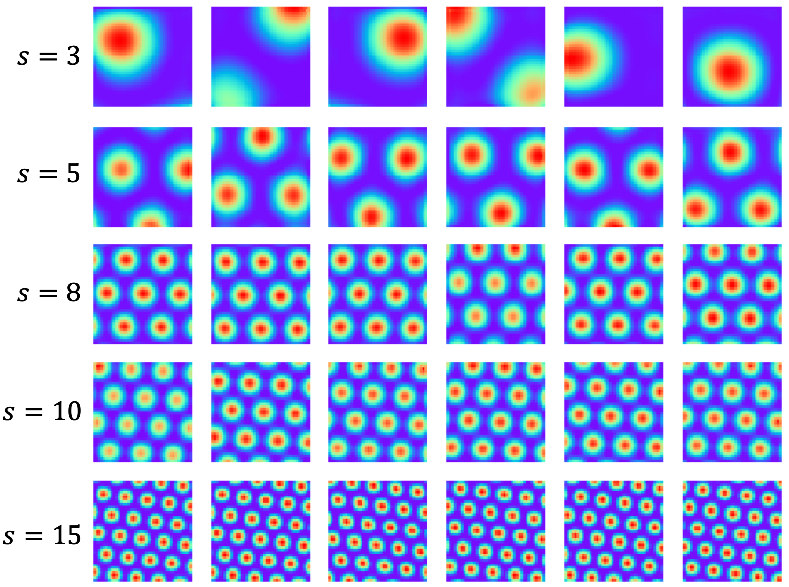
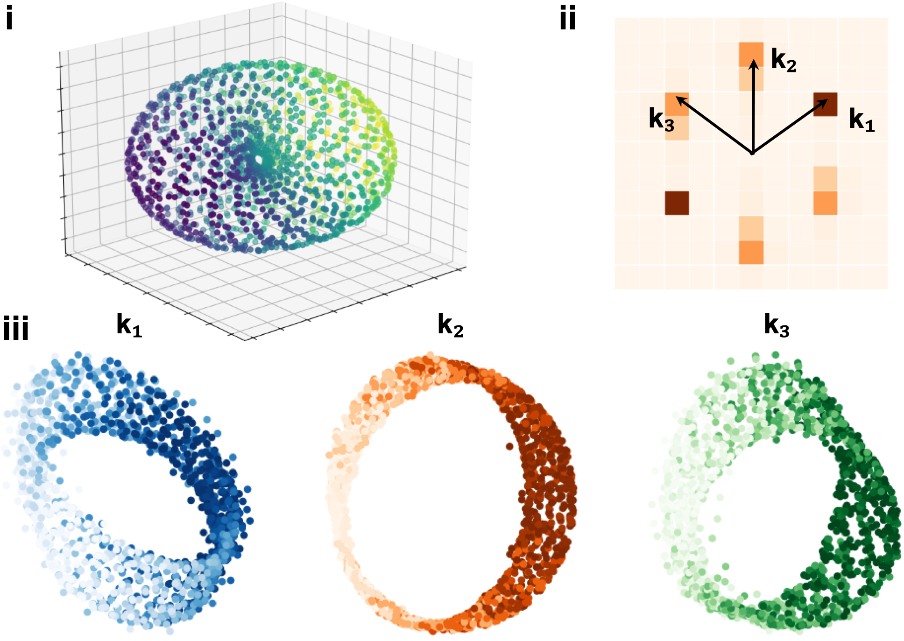

# On Conformal Isometry of Grid Cells: Learning Distance-Preserving Position Embedding
This repo contains the official implementation for the paper [On Conformal Isometry of Grid Cells: Learning Distance-Preserving Position Embedding](https://arxiv.org/abs/2405.16865), which is published in ICLR 2025 (Oral Presentation 1.8%). 

Authors: [Dehong Xu](https://dehongxu.github.io/), [Ruiqi Gao](https://ruiqigao.github.io/), [Wen-Hao Zhang](https://profiles.utsouthwestern.edu/profile/210799/wenhao-zhang.html), [Xue-Xin Wei](https://sites.google.com/view/xxweineuraltheory/research), [Ying Nian Wu](http://www.stat.ucla.edu/~ywu/research.html)

--------------------

This paper explores the conformal isometry hypothesis as an explanation for the hexagonal periodic patterns observed in grid cell response maps. We show that by learning a maximally distance-preserving position embedding, this hypothesis naturally yields the hexagonal grid firing patterns.
<div align="center">
  
  
</div>

## Requirements
Requires python >= 3.5. To install dependencies:
```angular2
pip install -r requirements.txt
```

## Usage
- To train the linear model with scaling factor $s=10$, run:

```angular2
python main.py --config=configs/linear_scale10.py
```

- To train the nonlinear model with ReLU activation, run:

```angular2
python main.py --config=configs/nonlinear1_relu.py
```

- To train the nonlinear model(additive version), run:

```angular2
python main.py --config=configs/nonlinear2_additive.py
```
In `configs` folder, we also provide the configurations for training linear models with different scales, and nonlinear model with different activation functions. 

